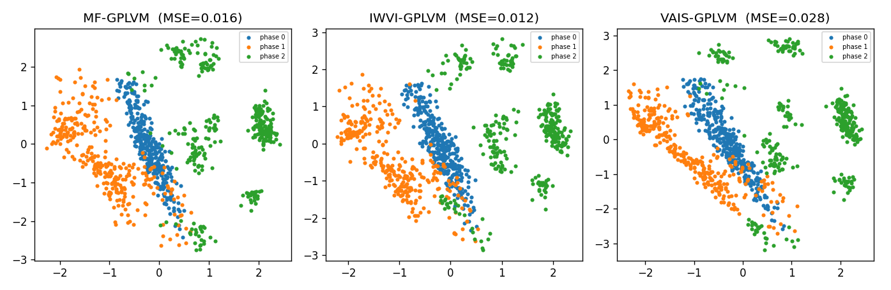
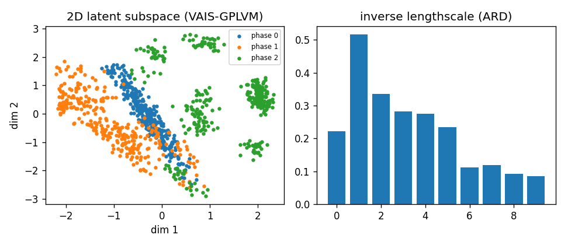
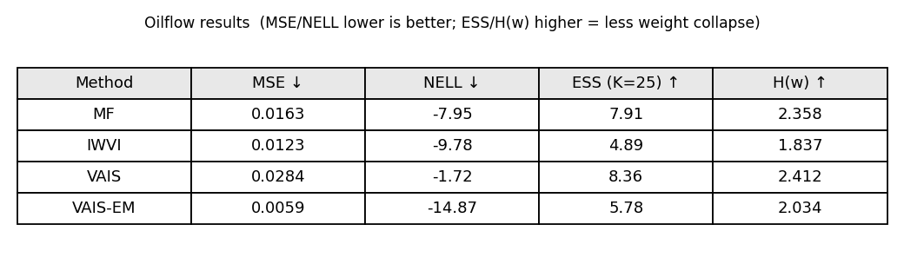

# VAIS-GPLVM

A clean PyTorch reproduction of **VAIS-GPLVM** — *Variational Learning of Gaussian
Process Latent Variable Models through Stochastic Gradient Annealed Importance
Sampling* (Xu et al., **UAI 2025**, PMLR; [arXiv:2408.06710](https://arxiv.org/abs/2408.06710)).

VAIS-GPLVM replaces the importance-sampling proposal of a Bayesian GPLVM with an
**Annealed Importance Sampling (AIS)** chain built from *time-inhomogeneous
unadjusted Langevin (ULA)* transitions. By transporting a simple base
distribution through a sequence of annealed intermediate densities toward the
posterior, it mitigates the **weight-collapse** that importance-weighted VI
(IWVI) suffers in high-dimensional latent spaces.

This repo implements the model and the two baselines (MF-GPLVM, IWVI-GPLVM)
under one shared sparse-GP core, and reproduces the qualitative findings on the
3-phase **Oil Flow** dataset (dimensionality reduction + the weight-collapse
diagnostics of the paper's Table 3).

---

## Method in one paragraph

A sparse GPLVM maps latents `H ∈ R^{N×Q}` to data `X ∈ R^{N×D}` through
independent GPs with inducing variables `u_d` and an SE-ARD kernel. The
variational posterior over `H` is constructed by an AIS chain: a base
`q0(h_n)=N(a_n, s_n²)` is annealed to the posterior via geometric bridges
`q_k ∝ q0^{1-β_k} · p(X,H)^{β_k}`, with each transition a ULA step
`H_k = H_{k-1} + η ∇log q_k + √(2η) ε`. The whole chain (including the
reversibility correction `R_{k-1}`) is differentiable, so all variational
parameters and GP hyperparameters are trained by stochastic gradient descent on
the resulting bound (Algorithm 1 of the paper, mini-batched).

---

## Results (Oil Flow, 1000×12, 3 classes)

All methods share the same setup (Q=10 latent dims, M=30 inducing points,
batch 200, identical learning rate, per-point diagonal likelihood).

| Method   | MSE ↓   | NELL ↓  | ESS (K=25) ↑ | H(w) ↑ |
|----------|---------|---------|--------------|--------|
| MF       | 0.0163  | −7.95   | 7.91         | 2.358  |
| IWVI     | 0.0123  | −9.78   | 4.89         | 1.837  |
| **VAIS** | 0.0284  | −1.72   | **8.36**     | **2.412** |
| VAIS-EM* | **0.0059** | **−14.87** | 5.78    | 2.034  |

- **MSE** — reconstruction error (standardized space). **NELL** — negative
  expected log-likelihood. Lower is better for both.
- **ESS / H(w)** — effective sample size and entropy of the K=25 importance
  weights; **higher = less weight collapse** (the paper's Table 3 diagnostic).
- **Key finding reproduced:** IWVI shows the lowest ESS / weight entropy
  (severe weight collapse), while **VAIS attains the highest ESS and entropy** —
  i.e. it spreads importance mass most uniformly, exactly the paper's central
  claim.
- `*` **VAIS-EM** is an optional engineering add-on in this repo (not in the
  paper): after AIS training, freeze the transported latents and refit the GP
  (an E→M step). It minimizes reconstruction error but trades away some of the
  anti-collapse behavior — included for completeness.

> Note: this repo evaluates models on reconstruction / predictive / weight-collapse
> metrics. The training objective is the AIS variational bound, but raw bound
> values from different methods are *different functionals* and are not directly
> comparable, so we do not report them as a comparison metric.

### Figures

| | |
|---|---|
| Latent space comparison (MF / IWVI / VAIS) |  |
| VAIS latent + ARD lengthscales |  |
| Diagnostics table |  |

All three methods recover the 3-phase class structure unsupervised; the ARD
inverse-lengthscales show only a few latent dimensions carry signal.

---

## Install & run

```bash
pip install -r requirements.txt

# 1. download the oil-flow dataset
bash scripts/download_data.sh

# 2. train VAIS-GPLVM (produces scripts/result.png)
python scripts/vais_gplvm.py --iters 1500

# 3. compare MF vs IWVI vs VAIS (produces scripts/compare.png)
python scripts/compare.py --iters 1500
```

### Repository layout

```
scripts/
  vais_gplvm.py    # standalone VAIS-GPLVM (Algorithm 1, mini-batch ULA-AIS)
  compare.py       # shared GPLVM core + MF / IWVI / VAIS baselines & diagnostics
  vais_tuned.py    # transported-latent reconstruction + MAP polish + tuning
  vais_final.py    # optional E→M refinement (best reconstruction MSE)
  download_data.sh # fetch the 3-phase oil flow dataset
figures/           # result figures
```

---

## Citation

```bibtex
@inproceedings{xu2025variational,
  title={Variational Learning of Gaussian Process Latent Variable Models through Stochastic Gradient Annealed Importance Sampling},
  author={Xu, Jian and Du, Shian and Yang, Junmei and Ma, Qianli and Zeng, Delu and Paisley, John},
  booktitle={Conference on Uncertainty in Artificial Intelligence},
  pages={4663--4680},
  year={2025},
  organization={PMLR}
}
```

## License

MIT — see [LICENSE](LICENSE).
